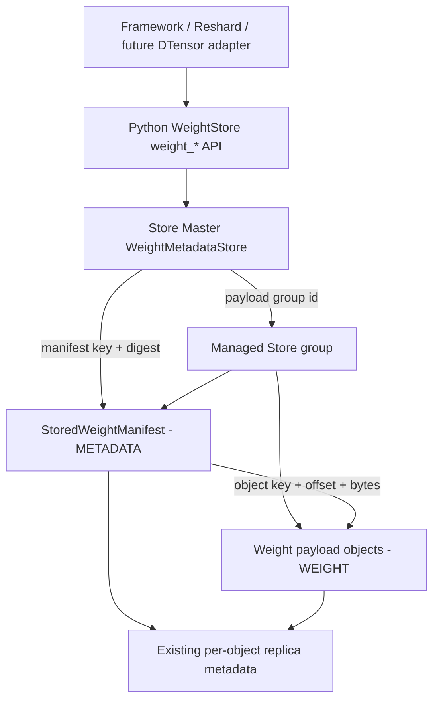

# [RFC] 将模型权重作为 Mooncake Store 的一等公民管理

## 摘要

本文提议在 Mooncake Store 中引入 revision 级 Weight Management：一个完整且
不可变的模型权重 revision 作为唯一管理聚合根，由 Store 统一负责发现、可用性、
驻留策略、读租约、generation replacement、迁移、删除以及 Master HA 恢复。

该方案继续使用现有 `StoredWeightManifest` 描述 Tensor、fragment、alias 和对象
range，不为每个 Tensor 再创建一份管理 metadata。Store Master 只保存轻量的
`WeightRevisionMetadata`，通过它定位并校验 manifest，再由 manifest 定位实际
payload：

```text
WeightRevisionMetadata -> StoredWeightManifest -> Store payload objects
```

manifest 与所有 payload 位于同一个 Store group。这个 group 是统一生命周期边界；
普通 Store eviction、单 key remove 和 cleanup 不能把一个 managed weight revision
拆成部分保留、部分删除的状态。

## 背景与动机

Mooncake 已经可以通过 manifest 保存和加载模型权重，但当前 unmanaged 路径仍有
以下限制：

1. 调用方必须预先知道 manifest object key，Store 不能按模型和 revision 发现权重。
2. Store 看到的是若干普通 object，无法表达“这些 object 共同组成一个不可分割的
   weight revision”。
3. 普通 eviction 或单 key 删除可能独立作用于 group member，缺少 revision 级
   生命周期保证。
4. manifest 只描述 Tensor 内容与位置，不适合承担会变化的 availability、residency、
   lease、operation 和 policy。
5. Store 不能表达一部分权重驻留内存、一部分驻留冷存储，也不能自动在内存压力和
   访问事件之间进行安全迁移。
6. Master 重启或切主后，没有统一的 revision 状态和 operation 进度用于恢复。

模型权重与普通 KV 的主要区别是：它们通常体积很大、内容不可变、会被多个 worker
重复加载，并且必须以一个完整 revision 被发布、读取、迁移和删除。因此本 RFC 建议
把 Weight Revision 提升为 Store 的一等管理资源，而不是把 Tensor 继续当成彼此独立
的 key。

## 与既有 RFC 的关系

本 RFC 建立在既有 Weight 与 Reshard RFC 之上，不替代其数据路径和语义契约：

- [RFC #2282：Unified KVCache and Model Weight Management in Mooncake Store](https://github.com/kvcache-ai/Mooncake/issues/2282)
  提出了 KVCache 与 Weight 共用 Store 资源底座、分别维护生命周期策略的方向，并以
  file/file-shard 粒度的 Weight import、hard pin 和启动加载作为第一阶段。本 RFC
  延续其 Weight Lifecycle Management 方向，把 file-level `WEIGHT` object 进一步
  提升为 revision-level managed resource；file-level importer/loader 仍可作为
  WeightStore 的输入适配层，但不承担 revision metadata authority。
- [RFC #3111：Manifest-driven heterogeneous model weight resharding and storage](https://github.com/kvcache-ai/Mooncake/issues/3111)
  定义了 Placement、Runtime Binding、`StoredWeightManifest`、N-D Reshard，以及
  runtime-to-Store 和 Store-to-runtime 数据路径。本 RFC 直接复用这些 manifest 和
  fragment 契约，不重新定义 Reshard；新增范围集中在 revision discovery、readiness、
  residency、lease、migration、deletion 和 HA recovery。
- [RFC #3747：COO-format sparse weight transfer for RL](https://github.com/kvcache-ai/Mooncake/issues/3747)
  与 [RFC #3953：Transfer COO sparse updates as structured objects](https://github.com/kvcache-ai/Mooncake/issues/3953)
  定义稀疏 delta 的对象格式、range 规划和应用语义。稀疏更新可由 adapter 物化为
  一个新的完整 generation，再交给本 RFC 的 `weight_upsert` 管理替换；直接依赖
  base payload 的 delta-backed revision 需要单独定义依赖保留、链压缩和回收协议。

## 目标

- 通过稳定的 revision identity 发现模型权重，不要求调用方持有 manifest key。
- 以完整 revision 为单位管理 readiness、residency、lease、migration 和 deletion。
- 复用 manifest 中已有的 Tensor/fragment 语义，不复制 Tensor metadata。
- 支持 HOT、COLD 和按完整 Tensor affinity 切分的 MIXED 驻留。
- 支持显式迁移，以及有界、可恢复的自动升降级。
- 在读取、迁移和删除并发时保持已有可读副本安全。
- 通过现有 Store Master OpLog 和 snapshot 支持 HA 恢复。
- 收敛到唯一的 managed `weight_*` API，不保留绕过 revision 生命周期的公开入口。
- 支持同一 lineage 内串行、幂等且可恢复的 generation replacement。
- 为未来 DTensor-native adapter 保留演进路径，而不把当前管理面绑定到某个框架。

## 术语

- **Weight Revision**：由一个不可变 manifest 和其引用的全部 payload object 组成的
  完整模型权重版本。
- **Revision Identity**：唯一标识一个 Weight Revision 的五元组。
- **Manifest**：描述 Tensor、fragment、alias、source placement 和 object range 的
  不可变对象。
- **Managed Group**：manifest 与全部 payload 共享的 Store group，是生命周期边界。
- **Residency**：全部必需 payload 当前在 memory/cold tier 中的聚合物理状态。
- **Affinity Unit**：迁移时不可拆分的完整 Tensor 或 alias group。
- **Revision Lease**：在一次读取期间阻止删除和释放既有副本的短租约。
- **Lineage**：`(tenant_id, namespace, resource_id, revision)`，包含该逻辑 revision
  的全部 `weight_generation`。
- **Replacement Claim**：按 lineage 持久化的单 successor 替换事务，记录
  `request_id`、base、target、mode 与 phase。

## 总体架构



### 数据权威边界

| 数据权威 | 存放位置 | 负责 | 不负责 |
| --- | --- | --- | --- |
| `WeightMetadataStore` | Active Master memory、HA OpLog、Master snapshot | revision discovery、policy、availability、residency summary、operation、lease、manifest reference、lineage claim 与 generation watermark | Tensor shape、fragment 几何、物理 replica address、serving active head |
| `StoredWeightManifest` | hard-pinned Store `METADATA` object | Tensor、fragment、alias、placement 与 payload range | lifecycle、lease、实时 replica 状态 |
| Store object metadata | 现有 Master per-key metadata | memory、local disk、DFS、NoF replica 及其可读状态 | revision discovery、Tensor 语义、serving activation |

`WeightRevisionMetadata` 位于 managed group 之外。这样即使 payload 已 COLD、部分
损坏、正在删除或已经物理删除，管理面仍能查询状态、继续 operation 或保留 tombstone。

manifest 与 payload 位于同一个 group，并由 manifest 最后提交。manifest 在所有
payload residency 下始终保留至少一个 hard-pinned、memory-readable replica；因此
`COLD` 只描述 payload，不包含 manifest。

这个 group 是逻辑生命周期边界，不是跨对象物理事务。迁移过程中可以暂时存在一部分
HOT、一部分 COLD，但 operation 在全组验证完成前不会发布终态，也不会允许冲突操作。

lineage claim 与 committed generation watermark 只用于 ordering、CAS fencing 和
故障恢复。它们不表示 serving active head；流量切换和回滚仍由 serving control plane
决定。

### Store 内部代码组织

Weight Management 属于 `mooncake-store`，但其领域逻辑不应堆叠在通用
`master_service.cpp` 中。独立的 `WeightStoreManager` 持有 Weight 状态并编排生命周期，
通过 `MasterStoreBackend` 使用现有 Store 基础设施：

```text
mooncake-store/
├── include/
│   ├── weight_management.h
│   ├── weight_metadata_store.h
│   ├── weight_residency_planner.h
│   ├── weight_store_manager.h
│   ├── weight_store_backend.h
│   └── master_service.h
└── src/
    ├── weight_metadata_store.cpp
    ├── weight_residency_planner.cpp
    ├── weight_store_manager.cpp
    ├── master_store_backend.cpp
    └── master_service.cpp
```

职责边界如下：

- `weight_management.h` 定义 identity、policy、metadata、lease、operation 和 wire
  contract；
- `weight_metadata_store.cpp` 负责 revision metadata、generation、lease、operation、
  snapshot 和 reverse index 状态机，不直接修改 Store object；
- `weight_residency_planner.cpp` 负责无副作用的 MIXED/AUTO 决策；
- `weight_store_manager.cpp` 持有 `WeightMetadataStore`、group/lineage 操作锁和
  生命周期配置，负责 import、query、policy、lease、upsert、migration、delete、
  reconciliation 以及 durable publication；
- `master_store_backend.cpp` 适配 group/object 观察、promotion、offload、物理删除
  和 durable OpLog，不持有第二份 object/replica 状态；
- `master_service.cpp` 保留普通 Store 主流程、通用 group/eviction 原语，以及调用
  Weight guard/reconciliation 的少量集成点。

这是组件所有权拆分，不新增独立服务或第二套存储。Weight RPC 保留原 server、地址和
handler 标识，内部转发给 manager。Master HA 统一协调快照、恢复和 promotion，通过
manager 导出/恢复 Weight 状态。`MasterService` 保留通用 Store 状态和底层对象锁。

并发顺序为 lineage → group → 底层对象操作。通用 put/remove/eviction 路径继续执行
managed-group 与 lease/generation 保护；manager 销毁前必须停止并排空 durable callback。

RPC、native client、configuration、OpLog、snapshot 和 standby 文件只保留各自边界上
必要的 Weight 接线。将这些代码集中复制到 Weight 文件会产生第二套 adapter/HA
authority，因此不属于本次拆分。

## Revision Identity 与对象布局

一个 revision 使用以下 identity：

```text
(tenant_id, namespace, resource_id, revision, weight_generation)
```

去掉 `weight_generation` 后得到 lineage：

```text
(tenant_id, namespace, resource_id, revision)
```

同一 lineage 的 generation 必须严格递增。`weight_upsert` 的 target generation 必须
同时大于 base generation 和 lineage 的 committed watermark；watermark 是防止旧
generation 在重试或切主后重新进入的顺序栅栏，不是当前 serving revision 的指针。

canonical manifest key 为：

```text
weights/<namespace>/<resource_id>/<revision>/<weight_generation>/manifest
```

路径组件分别进行 UTF-8 URL encoding。revision 发布后，以下字段不可变：

- manifest key 与 manifest SHA-256；
- payload group ID；
- 排序后 payload keys 的 SHA-256；
- payload count；
- logical payload bytes；
- affinity count 与 digest。

Master 校验 object type、group membership、payload count、logical bytes 和 payload
key digest，但不解析 Tensor manifest body。Python `weight_get` 在规划和传输之前校验
manifest identity 与 SHA-256。

## 状态模型

Availability、observed residency 和 operation 是三个正交维度：

| 维度 | 值 | 含义 |
| --- | --- | --- |
| Availability | `IMPORTING`, `READY`, `DEGRADED`, `DELETING`, `DELETED` | revision 是否完整且可安全发现、读取 |
| Residency | `UNKNOWN`, `HOT`, `COLD`, `MIXED`, `ABSENT` | 必需 payload 的聚合物理驻留状态 |
| Operation | 可选 operation ID，指向 `MIGRATING` 或 `REPAIRING` | 当前持久化的非终态后台操作 |

主要不变量：

- `IMPORTING` 对应 `UNKNOWN`，且对普通发现和读取不可见。
- `READY` 只对应 `HOT`、`COLD` 或 `MIXED`。
- `READY` 表示 manifest 和所有必需 payload 都至少有一个可读副本；不要求 observed
  residency 已经等于 preferred residency。
- `DEGRADED` 表示至少一个必需 member 失去全部可读副本。
- `DELETED` 对应 `ABSENT`，没有 active lease 或 active operation。
- `MIGRATING` 是 operation kind，不是 residency。一个 revision 可以在 observed
  residency 为 `MIXED` 时，正在向 `COLD` 迁移。
- terminal operation 可继续按 ID 查询，但 revision metadata 会清除 active
  `operation_id`。

所有 mutation 都由 `expected_metadata_generation` 进行 CAS fencing。过期调用方收到
`STALE_GENERATION`，不能覆盖更新后的 revision 状态。

## 驻留策略

每个 revision 持久化以下 policy：

```python
@dataclass(frozen=True)
class WeightStoragePolicy:
    preferred_residency: WeightResidencyState = WeightResidencyState.MIXED
    mixed_hot_ratio: float = 0.5
    migration_mode: WeightMigrationMode = WeightMigrationMode.AUTO
```

Policy 解析优先级为：

```text
weight_put(policy=...)
    > WeightStore(default_policy=...)
    > Store Master cluster default
```

### Preferred residency

- `HOT`：所有必需 payload 均有可读 memory replica。
- `COLD`：所有必需 payload 均有可读 cold replica，读取不依赖 memory replica。
- `MIXED`：一部分完整 affinity unit 为 HOT，其余为 COLD。

`MIXED` 比例定义为：

```text
hot logical payload bytes / total logical payload bytes
```

`0 < mixed_hot_ratio < 1`，默认值为 `0.5`。算法选择完整 affinity unit，使实际
HOT bytes 尽量接近目标值；不能为精确比例拆分一个 Tensor 或 alias group。若模型
结构决定无法精确满足目标，metadata 返回实际 `observed_hot_ratio`。

### Migration mode

- `PINNED`：完成初始 preferred 收敛后固定当前 residency，拒绝后续 residency 改变。
- `MANUAL`：完成初始 preferred 收敛后，仅接受显式 `weight_migrate`。
- `AUTO`：完成初始 preferred 收敛后，允许根据访问和内存压力自动升降级，也接受
  显式迁移。

`PINNED` 约束物理驻留，不阻止在无 active lease/operation 时显式删除 revision。
第一版只有显式删除，因此不增加只有单一取值的 retention policy。

`preferred_residency` 是 AUTO 模式下的回归目标，而不是硬性的内存下限。内存压力可以
让 AUTO revision 暂时变得比 preferred 更冷；后续访问或压力解除后再向 preferred
收敛。需要硬驻留保证时应使用 `PINNED`。

## Python API

公开管理入口仍然只有 `mooncake.reshard.weight.WeightStore`：

| API | 语义 |
| --- | --- |
| `weight_put` | 上传 payload，最后提交 manifest，并发布 revision |
| `weight_get` | 获取 revision lease，解析 manifest，并加载或 Reshard 到目标布局 |
| `weight_is_exist` | 仅在精确 revision 为 `READY` 且可读时返回 `True` |
| `weight_get_metadata` | 获取轻量 revision metadata 与 manifest reference |
| `weight_get_size` | 返回提交时校验过的 logical payload bytes |
| `weight_list` | 按 namespace/resource 分页发现 revision，不读取完整 manifest |
| `weight_update_policy` | 仅更新 policy，并使用 metadata generation fencing |
| `weight_upsert` | 在同一 lineage 中用更高 generation 替换 base revision |
| `weight_migrate` | 创建一次显式 residency migration operation |
| `weight_get_operation` | 查询异步 operation 的 target、进度和错误 |
| `weight_remove` | 显式整组删除，并保留可查询 tombstone |

示例：

```python
policy = WeightStoragePolicy(
    preferred_residency=WeightResidencyState.MIXED,
    mixed_hot_ratio=0.5,
    migration_mode=WeightMigrationMode.AUTO,
)

with weight_store.weight_put(snapshot, adapter, policy=policy) as writer:
    identity = writer.identity
    for tensor_id, tensor in tensors:
        writer.weight_put_tensor(tensor_id, tensor)

view = weight_store.weight_get_metadata(identity)
manifest = weight_store.weight_get(identity, target_placement, target_bindings)

updated = weight_store.weight_update_policy(
    identity,
    policy=new_policy,
    expected_metadata_generation=view.metadata.metadata_generation,
)

with weight_store.weight_upsert(
    next_snapshot,
    adapter,
    replacing=identity,
    expected_metadata_generation=updated.metadata_generation,
    mode=WeightUpsertMode.PUT_FIRST,
    request_id="rollout-2026-09-11-001",
    policy=new_policy,
) as successor:
    for tensor_id, tensor in next_tensors:
        successor.weight_put_tensor(tensor_id, tensor)
next_identity = successor.identity

operation = weight_store.weight_migrate(
    identity,
    target=WeightResidencyState.COLD,
    expected_metadata_generation=updated.metadata_generation,
)
operation = weight_store.weight_get_operation(operation.operation_id)
```

## 生命周期与数据流

### Import 与 READY 发布

```text
weight_put(policy)
  -> BeginWeightImport
  -> 将全部 payload 写入 Store memory replica
  -> 最后提交 immutable StoredWeightManifest
  -> CommitWeightImport 校验完整 group
  -> durable publish: READY + HOT
  -> preferred != HOT 时同时创建 MIGRATING(target=preferred)
  -> weight_put 返回；reconciliation 异步收敛 preferred
```

所有 import 都先形成完整 HOT revision。`READY + HOT` 是一致性检查点：一旦发布，
revision 已经可读。COLD/MIXED 是随后进行的物理迁移，不应推迟 READY。

若 preferred 是 COLD 或 MIXED，READY metadata 和初始 MIGRATING operation 在同一个
durable mutation 中发布。初始收敛适用于 PINNED、MANUAL 和 AUTO；migration mode
只控制初始收敛完成后的行为。

payload、manifest 或 commit 任一阶段失败时都不能发布 READY。相同 identity 的重试
使用 generation fencing，并且不能重复创建 group、manifest 或 operation。

### Get 与 revision lease

```text
identity
  -> get exact metadata
  -> acquire generation-fenced revision lease
  -> read and verify manifest
  -> plan target ranges / Reshard
  -> transfer payload
  -> release lease
```

lease 在成功、异常和取消路径释放；调用方崩溃后由 TTL 过期。active revision lease：

- 阻止 revision 删除；
- 阻止释放已有可读 replica；
- 不阻止迁移创建和验证新的 replica。

revision lease 不替代 framework allocation guard、runtime binding generation 或 Store
per-object read lease，这些机制保护不同的 ownership boundary。

### Generation replacement

`weight_upsert(snapshot, adapter, *, replacing, expected_metadata_generation,
mode=WeightUpsertMode.PUT_FIRST, tenant_id="default", policy=None,
request_id=None)` 只接受与 `replacing` 相同 lineage、且 generation 更高的 target。
调用方未提供 `request_id` 时，`WeightStore` 对 base identity、target identity、mode
和 `expected_metadata_generation` 的 canonical representation 计算确定性 hash；相同
参数在 begin 响应丢失后会得到相同 ID。显式 `request_id` 原样使用。相同 request 与
相同不可变参数返回原 claim 或继续原 phase，不同 request 不能为同一 lineage 并发
建立第二个 successor。

`PUT_FIRST` 是默认模式：

```text
durable claim -> import target -> target READY
              -> durable fence/retire base -> drain existing base leases
              -> delete base -> commit lineage watermark
```

base 在 target 达到 `READY` 前保持可读；target 上传或提交失败会终止 claim，并保留
base。target 发布后拒绝新的 base lease 和 lease renewal，已有 lease 可在 drain 期间
完成。该模式的峰值存储接近两份完整 revision。

`DELETE_FIRST` 是显式的容量优先模式：

```text
durable claim -> require no base lease or operation -> fence and delete base
              -> allow target import -> target READY -> commit lineage watermark
```

有 active lease 或 lifecycle operation 时，删除前返回 `BUSY`，不产生删除副作用。
base 删除后才允许 target payload import，因此峰值较低；从 base 删除完成到 target
`READY` 之间不可用，target 失败也无法由 Store 回滚到已删除的 base。恢复过程使用
原 `request_id` 从持久化 phase 继续。

### Residency migration

`weight_migrate` 先持久化 operation，再执行物理副作用：

- 到 COLD：先创建并验证 cold replica，再释放 memory replica；
- 到 HOT：创建并验证所有必需 payload 的 memory replica；
- 到 MIXED：提升 planner 选中的完整 affinity unit，安全下沉其余 unit。

迁移可能分批完成。每轮限制 member 数和 logical bytes，但一个完整 affinity unit 即使
超过单轮上限，也必须保证至少有一个 unit 可以前进，不能为满足上限拆分 Tensor。

操作失败但已有数据仍可读时，revision 保持 `READY`；错误与进度保存在 operation 中，
reconciliation 可继续重试。只有必需 payload 失去全部可读副本时才进入
`DEGRADED`。

### 自动迁移

自动迁移复用 active Master 上有界的 Weight reconciliation loop。候选必须满足：

```text
availability == READY
migration_mode == AUTO
operation_id is None
active_lease_count == 0
```

内存压力下，候选按持久化的最近访问时间、可释放 HOT bytes 和稳定 revision identity
确定性排序，并逐步执行 `HOT -> MIXED -> COLD`。COLD/MIXED revision 被访问时，
系统先持久化 promotion operation，再授予与新 generation 对应的 lease。

cooldown、每轮 member 上限和 byte 上限用于限制抖动与后台放大。切主后根据持久化
operation 与真实 replica 状态继续，而不是重建 group 或重新开始计数。

### Delete 与普通 eviction

第一版只支持显式整组删除：

```text
READY/DEGRADED
  -> DELETING，拒绝新 lease
  -> 分批删除 payload
  -> 最后删除 manifest
  -> 验证 group 已空
  -> DELETED + ABSENT tombstone
```

active lease 或 migration 存在时，删除返回 `BUSY`。删除批次失败时保留
`DELETING` 和进度；重试或切主从剩余 member 继续。

普通 `BatchEvict`、quota eviction、单 key remove 和 cleanup 必须识别 managed group
并跳过。已有 cold durability 后释放 memory replica 属于 residency migration，不是
逻辑 Weight eviction。

## 并发、一致性与错误处理

- 每个 revision mutation 携带 `expected_metadata_generation`。
- 同一 revision 同时只允许一个 active operation。
- 同一 lineage 同时只允许一个非终态 replacement claim；target generation 必须大于
  base generation 和 committed watermark。
- replacement 以 `request_id` 幂等；同一 ID 的参数必须完全一致，竞争 request 返回
  `CONFLICT` 或 `BUSY`，不能创建第二个 successor。
- 所有授权发现、读取或 destructive action 的状态都遵循 durable-before-visible。
- metadata 只保存可选 active operation ID；kind、target、progress、cursor 和 error
  message 存在独立 operation record 中。
- operation ID 和进度在 retry、Master restart 和 failover 后保持稳定、单调。
- 重复请求返回原有 committed 结果，不创建第二个 group、operation 或 tombstone。

主要错误包括：

- `INVALID_ARGUMENT`
- `NOT_FOUND`
- `NOT_READY`
- `CONFLICT`
- `STALE_GENERATION`
- `BUSY`
- `LEASE_EXPIRED`
- `DURABILITY_FAILED`
- `POLICY_UNSATISFIABLE`

## HA 与升级

Weight metadata、lease、operation、lineage claim 和 generation watermark 通过现有
Master HA 机制持久化：

- mutation 先进入 OpLog，durable 后才对 active Master 可见；
- standby 使用独立的 weight-metadata namespace replay，不把它们编码成伪造的 object
  metadata；
- Master snapshot 增加可选 `weight_metadata` section；
- 旧 snapshot 不含该 section 时恢复为空；存在但 schema 非法时 fail closed；
- restore 后从 authoritative records 重建 group reverse index。
- restore 后按 claim phase 和真实 group/revision 状态继续 target import、base lease
  drain 或删除；重放不得降低 generation watermark，也不得创建新的 successor。

使用 HA 与 etcd batch OpLog 的集群需要两个独立 gate。
`weight_management_oplog_capability_confirmed` 只覆盖普通 Weight metadata 的 OpType
8–11；其升级和 fail-closed 语义保持不变。lineage claim 使用 OpType 12，因此
`weight_upsert` 还要求 `weight_lineage_oplog_capability_confirmed=true`。滚动升级时先
升级全部 standby，使其能够重放 OpType 12，再在 active 配置中打开新 flag。新 flag
未确认时只有 lineage mutation fail closed；已由原 flag 放行的普通 Weight mutation
和 Store KV 读写不受影响。

## 配置

Master 提供 cluster default：

```yaml
default_weight_preferred_residency: "mixed"
default_weight_mixed_hot_ratio: 0.5
default_weight_migration_mode: "auto"
weight_management_oplog_capability_confirmed: false
weight_lineage_oplog_capability_confirmed: false
weight_migration_cooldown_ms: 30000
weight_migration_max_members_per_round: 64
weight_migration_max_bytes_per_round: 1073741824
```

非法 residency、migration mode、MIXED ratio 或零批次上限在启动时 fail closed。
cluster default 只影响后续新 revision；已发布 revision 始终使用自身持久化 policy。

## API 收敛与旧数据处理

`WeightStore` 不再提供 unmanaged public path。应用只能通过 `weight_put` 发布
revision，通过 `weight_get_metadata` 或 `weight_list` 发现 revision，并通过
`weight_get` 在 revision lease 保护下加载。manifest key、payload plan 和底层传输
原语属于内部实现细节，不能作为应用级 identity 或生命周期入口。

因此直接按 manifest key 操作的 `load_manifest`，以及 `begin_weight_snapshot`、
`plan_upload`、`upload`、`commit_upload`、`plan_load` 和 `load` 等旧入口直接删除，
不提供 deprecated wrapper。通用 `MooncakeDistributedStore` 也不再暴露 Weight writer
shortcut；调用方显式创建 `WeightStore`，使普通 KV 与 Weight 的管理边界保持清晰。

policy mutation 从旧名直接替换为 `weight_update_policy`，不保留 alias 或 deprecated
wrapper。

旧 unmanaged 数据不会自动进入 revision metadata。确需继续使用的数据必须通过
`weight_put` 重新发布为明确 revision，随后才能获得 discovery、lease、整组迁移和
删除保证。

## 与 Reshard、Transfer Engine 和 DTensor 的关系

写入 Store 时保留 source fragment，不提前转换为目标 TP/PP/DP/EP layout。真正的
Reshard 发生在 `weight_get`：

```text
identity -> metadata -> manifest/source ranges
         -> target placement/bindings -> Store transfer
```

本 RFC 复用当前 Store 的 registered-buffer put/get 原语，不依赖另一个 Transfer
Engine Reshard PR 合入。未来如果 WeightStore 支持 DTensor-native 输入，只需要由
DTensor adapter 生成 canonical placement、binding 和 manifest；revision metadata、
policy、lease 和 lifecycle API 不需要改变。

#3747 与 #3953 的 COO sparse update 可以由 adapter 应用到 base 后生成新的完整
snapshot，再以更高 generation 进入 `weight_upsert`。本 RFC 不把 delta object 当作
可独立 serving 的完整 revision；若 target manifest 直接引用 base payload 和 delta，
则必须另行定义 dependency lease、base retention、链深上限和 compaction。

## 可观测性与性能边界

至少暴露以下指标：

- 各 availability/residency revision 数量；
- active operation、失败和重试数量；
- migration processed bytes、remaining bytes 和耗时；
- active/expired lease 数量；
- 各 mode/phase 的 replacement claim 数量、失败和恢复次数；
- AUTO demotion/promotion 触发原因；
- 被 managed-group guard 跳过的普通 eviction/remove 次数。

metadata 查询不读取完整 manifest。AUTO candidate selection 和 reconciliation 按轮次
有界执行，不在单次普通 Store key 请求中进行全量 revision scan。MIXED planner 使用
manifest 生成的 affinity summary，并以确定性方式选择完整 unit。

## 安全不变量

1. metadata 只能引用一个 immutable manifest identity。
2. payload 与 manifest 完整提交并通过 group 校验前，不发布 READY。
3. manifest reference 与 payload summary 在 READY 后不可变。
4. stale generation 不得覆盖新状态。
5. active lease 阻止删除和释放已有副本。
6. cold replica 未验证可读前，不释放最后一个 memory replica。
7. generic Store lifecycle 不得部分处理 managed group。
8. terminal state 不残留 active lease 或 active operation。
9. metadata 不保存 Tensor、fragment、runtime address 或 framework 对象。
10. failover 后由持久化状态和实际 replica 共同决定下一步，不能只相信旧进度。
11. lineage claim 和 watermark 不得被解释为 serving active head。
12. `PUT_FIRST` 在 target READY 前不得 retire base；`DELETE_FIRST` 在确认无 lease 或
    operation 前不得删除 base，也不得在 base 删除前允许 target import。

## 验收计划

### Contract 与 API

- identity、digest、policy 和 state combination 严格校验；
- `WeightStore` 的 public method 只包含本 RFC 定义的十一个 `weight_*` API；payload
  plan、manifest-key lookup 和 buffer registration helper 均为内部实现；
- `weight_update_policy` 是唯一 policy mutation 名称，不存在旧名 wrapper；
- 通用 `MooncakeDistributedStore` 不暴露 Weight writer shortcut；
- `weight_put -> weight_get_metadata -> weight_get -> weight_remove` 公共路径通过；
- `weight_is_exist` 在各 availability 和 MIGRATING 状态下返回正确结果；
- list pagination、operation query、same-value retry 和 stale generation 通过。
- `weight_upsert` 校验 lineage 与 generation；同 request 重试幂等，竞争 successor
  被拒绝。

### Lifecycle 与 migration

- READY 必须先以 HOT 发布，再异步收敛 preferred；
- HOT/COLD/MIXED 全部合法迁移路径通过；
- MIXED 默认 50%、支持 override，且不拆分 Tensor/alias affinity；
- manifest 在 COLD/MIXED 时保持 memory-readable；
- active lease 期间可创建新副本，但不能释放已有副本或删除 revision；
- cold write/validation 失败不会破坏仍可读的 READY revision；
- 大 group 的 migration/delete 可分批推进并从中断位置恢复。
- `PUT_FIRST` 的 target 失败保留 base，target READY 后才 fence base，并在 lease drain
  后删除；`DELETE_FIRST` 在无 lease/operation 时先删除 base，随后才允许 target
  import，并显式暴露不可用与不可回滚窗口。

### HA 与非回归

- metadata、lease、operation、tombstone、lineage claim 和 watermark 可通过
  OpLog/snapshot 恢复；
- duplicate/reordered retry 幂等，旧 generation fail closed；
- 原 capability flag 未确认时拒绝普通 Weight metadata mutation；lineage flag 未确认时
  单独拒绝 `weight_upsert`；
- ordinary Store 和 KVCache 行为无回归；
- Master restart/failover 后 operation ID 与进度保持稳定。
- Master restart/failover 后 replacement 从原 phase 继续，且 lineage 仍只有一个
  successor。

### 环境验证

- Linux native Store build 和定向 CTest；
- Python Reshard/WeightStore 全量 contract suite；
- 至少一条真实 Store Master + native binding 的 managed Weight E2E；
- 有真实 cold replica 的 COLD/MIXED、lease、failure injection 和 restart 恢复测试；
- RDMA 仅在真实 HCA 双节点数据面验证后声明支持；
- 长时间 migration/lease/recovery soak 作为合入前或后续 release gate 明确记录。

## 希望社区重点反馈的问题

1. 是否认可 revision 作为唯一管理聚合根，以及 metadata、manifest、object metadata
   三层权威边界？
2. 是否认可 manifest 始终 memory-readable、而 COLD/MIXED 只统计 payload？
3. 是否认可 OpType 8–11 与 lineage OpType 12 使用独立 capability flag，并要求先升级
   全部 standby、再启用 lineage mutation？
