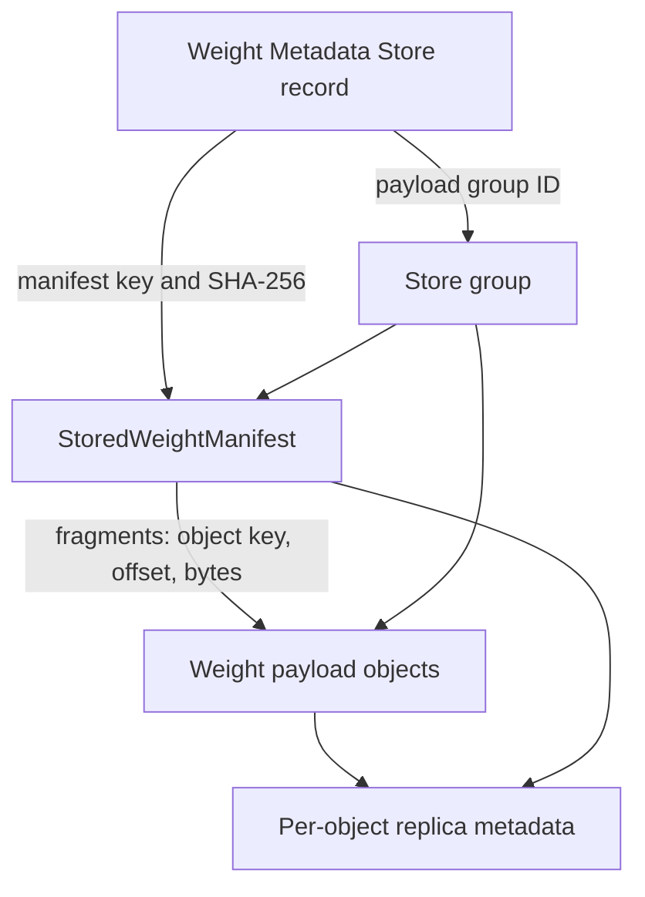

# Weight Management Architecture

Mooncake Store manages one immutable model-weight revision as a first-class
resource. A caller discovers the revision by its exact identity, acquires a
revision lease, resolves its immutable manifest, and then transfers the
manifest's payload ranges. Callers do not need to know the manifest object key
in advance.

This design adds revision-level discovery and lifecycle control without adding
independent tensor-level management metadata.

## Authority Model

Three records have distinct authority:

| Authority | Location | Owns | Does not own |
| --- | --- | --- | --- |
| Weight Metadata Store | Store Master memory, HA OpLog, and Master snapshot | exact revision discovery, availability, residency summary, operation progress, revision leases, manifest reference, lineage claims and generation watermarks | tensor geometry, payload contents, physical replica addresses, serving active head |
| `StoredWeightManifest` | immutable Store `METADATA` object | tensor descriptors and tensor-fragment-to-object-range mapping | lifecycle state, leases, live runtime addresses |
| Store object metadata | existing per-key Master metadata | replica placement and status in memory, local disk, DFS, or NoF | revision discovery, tensor meaning, serving activation |



The metadata record stays outside the payload group. It therefore remains
discoverable while the group is cold, degraded, deleting, or physically
absent. The manifest and every payload object share one `payload_group_id`.
Generic eviction and removal paths recognize that group as managed and cannot
independently reclaim one member.

The group is a logical lifecycle boundary, not a distributed transaction.
Physical work may be partial while an operation is running. The metadata store keeps
the operation non-terminal until reconciliation observes the required state
for every member.

Replacement state is keyed by the lineage
`(tenant_id, namespace, resource_id, revision)`. Its claim and committed
generation watermark provide ordering, CAS fencing, and recovery. They do not
identify which generation a serving system has activated.

## Revision Identity and Manifest Location

A revision is addressed by:

```text
(tenant_id, namespace, resource_id, revision, weight_generation)
```

The first four fields form the lineage. Generations within a lineage increase
strictly. A replacement target must be newer than both its base generation and
the lineage's committed watermark.

Its manifest object key is canonical:

```text
weights/<namespace>/<resource_id>/<revision>/<weight_generation>/manifest
```

The three textual path components are UTF-8 URL-encoded as individual path
segments. The manifest is hard-pinned during import and stored as
`ObjectDataType::METADATA`. Payload fragments are stored as
`ObjectDataType::WEIGHT` in the same group.

After publication, the manifest key, manifest SHA-256, payload group ID,
payload-key SHA-256, payload count, and logical byte count are immutable.
The Master validates object type, exact group membership, count, logical
bytes, and the digest of sorted payload keys. It deliberately does not parse
the tensor manifest body. A consumer must verify the stored manifest's identity
and SHA-256 before planning tensor ranges.

## State Model

Availability, physical residency, and an in-progress operation are separate:

| Dimension | Values | Meaning |
| --- | --- | --- |
| Availability | `IMPORTING`, `READY`, `DEGRADED`, `DELETING`, `DELETED` | whether the complete revision is safe to discover and load |
| Residency | `UNKNOWN`, `HOT`, `COLD`, `MIXED`, `ABSENT` | observed placement across required group members |
| Operation | `NONE`, `EVICTING`, `REHYDRATING`, `REPAIRING` | durable non-terminal group work |

`READY` means the manifest and every required payload object have a readable
replica. DRAM eviction changes residency but does not by itself make a revision
unavailable. Missing required members produce `DEGRADED`; complete physical
removal produces the retained `DELETED`/`ABSENT` tombstone.

Every mutation is fenced by `expected_metadata_generation`. A stale writer
fails with `STALE_GENERATION`. A retry of an uncertain import commit with the
same generation and immutable manifest reference is idempotent.

A lineage has at most one non-terminal replacement claim. The claim records a
`request_id`, base and target identities, mode, and phase. Retrying the same ID
with identical arguments resumes that claim; another request cannot create a
concurrent successor.

Each revision persists a `WeightStoragePolicy` with a preferred residency
(`HOT`, `COLD`, or `MIXED`), a MIXED hot-byte ratio, and a migration mode
(`PINNED`, `MANUAL`, or `AUTO`). A per-import policy overrides the Python
`WeightStore` default, which overrides the Master cluster default.

## Import and Publication

The managed upload sequence is:

1. `BeginWeightImport` creates or returns the `IMPORTING` metadata record and
   Store-issued canonical payload group ID.
2. `WeightStore` writes every payload object into that group.
3. The immutable `StoredWeightManifest` is committed last into the same group.
4. `CommitWeightImport` validates exact group membership and the manifest
   reference, then durably publishes `READY`.
5. `GetWeightRevision` or bounded `ListWeightRevisions` can discover it.

`READY` is never inferred from key prefixes. An abandoned import is handled by
the explicit abort/reconciliation policy.

## Load and Revision Leases

A reader first resolves the exact metadata identity with `GetWeightRevision`
and acquires a revision lease against the returned metadata generation. It then
reads and validates the manifest, plans ranges, and executes Store-to-runtime
transfers. The caller renews short leases until all transfer work reaches a
terminal state and releases the lease on both success and failure.

A live revision lease blocks deletion and residency operations that could
remove the last readable replica. Revision leases do not replace framework
allocation guards, runtime binding generations, or Store's per-object read
leases; those protect different ownership boundaries.

## Generation Replacement

`WeightStore.weight_upsert(snapshot, adapter, *, replacing,
expected_metadata_generation, mode=WeightUpsertMode.PUT_FIRST,
tenant_id="default", policy=None, request_id=None)` creates a writer for a
higher generation in the same lineage as `replacing`. When `request_id` is
omitted, `WeightStore` deterministically hashes the canonical base identity,
target identity, mode, and `expected_metadata_generation`. The same call after
a lost begin response therefore derives the same ID. An explicit `request_id`
is used unchanged. This operation replaces one immutable generation with
another; it is not an in-place overwrite of an ordinary Store key.

`PUT_FIRST` is the default. Store imports the target and publishes it `READY`
before durably fencing and retiring the base. New base leases and renewals are
then rejected, existing leases drain, and reconciliation deletes the base. A
failed target upload or commit leaves the base intact. Peak storage approaches
two complete revisions.

`DELETE_FIRST` requires the base to have no active lease or lifecycle
operation. Store fences and deletes the base before allowing target payload
import. This reduces peak storage, but creates an unavailable interval until
the target reaches `READY`; a target failure cannot be rolled back to the
deleted base. HA recovery resumes either mode from the persisted claim phase
and observed revision/group state.

## Residency, Migration, and Deletion

`StartWeightResidencyOperation` durably records the operation ID, target,
fenced metadata generation, and progress. Reconciliation then uses existing
per-object primitives:

- `EVICTING` removes memory replicas only after a readable cold replica exists
  for each affected member;
- `REHYDRATING` queues promotion for every group member and waits until all
  required members have readable memory replicas;
- busy or incomplete members keep the operation in progress;
- deletion blocks new leases, waits for live leases, removes payload objects,
  removes the manifest last, verifies absence, and retains a tombstone.

Generic `BatchEvict`, quota eviction, explicit remove, and cleanup paths skip
managed groups. Only the weight lifecycle path may change their aggregate
residency or availability.

## Recovery and HA Rollout

Weight metadata, leases, operation records, lineage claims, and generation
watermarks use durable-before-visible OpLog publication. Standby replay stores
them in a separate weight-metadata
namespace rather than encoding them as fake object metadata. Master snapshots
carry an optional `weight_metadata` section; an older snapshot without the
section restores empty Weight metadata while preserving ordinary KV metadata.
Derived group indexes are rebuilt from restored metadata records.

After restoration, reconciliation resumes target import, base-lease drain, or
base deletion from the stored replacement phase. Replay cannot lower the
committed watermark or create another successor for the lineage.

Clusters using HA plus the etcd batch OpLog have separate rollout gates. The
existing `weight_management_oplog_capability_confirmed` flag covers ordinary
Weight metadata OpTypes 8–11. Lineage claims use OpType 12, and
`weight_upsert` additionally requires
`weight_lineage_oplog_capability_confirmed=true`.

Upgrade every standby to a version that can replay OpType 12 before enabling
the lineage flag on the active configuration. While the new flag is false,
lineage mutations fail closed. Ordinary Weight mutations remain governed by
the original flag, and Store KV reads and writes are unaffected.

## Serving-System Boundary

Store owns durable revision discovery, readable-residency state, leases, and
safe reclamation. Its lineage watermark is not a serving-active pointer.
SGLang or another runtime owns live GPU addresses, runtime
bindings, allocation guards, and worker-local snapshot generations. Slime,
Kubernetes, Ray, or another serving control plane owns multi-worker activation,
traffic switching, and rollback. Store does not choose a globally active
serving revision.

## Public API Boundary

Applications publish with `weight_put` and
`WeightStoreWriter.weight_put_tensor`, retain the resulting
`WeightRevisionIdentity`, discover revisions with `weight_get_metadata` or
`weight_list`, and load with `weight_get`. Policy-only changes use
`weight_update_policy`; there is no old-name compatibility wrapper. A caller
uses `weight_upsert` with `replacing=<base identity>` for generation
replacement and chooses `DELETE_FIRST` only when its capacity constraint
justifies the explicit downtime and non-rollback window.

There is no unmanaged public path. Manifest keys, upload plans, transaction
records, and payload transfers are internal details of `WeightStore` and do not
identify a usable revision. The generic `MooncakeDistributedStore` binding does
not expose Weight writer shortcuts; callers construct `WeightStore` explicitly.

Data written by an older unmanaged path is not added to revision metadata
automatically. Publish it again with `weight_put` before relying on discovery,
leases, group migration, or deletion.

Sparse-update RFCs [#3747](https://github.com/kvcache-ai/Mooncake/issues/3747)
and [#3953](https://github.com/kvcache-ai/Mooncake/issues/3953) can feed this
lifecycle through an adapter that materializes a new complete generation. A
delta-backed revision that directly depends on base payloads needs a separate
design for dependency leases, base retention, chain depth, and compaction.
