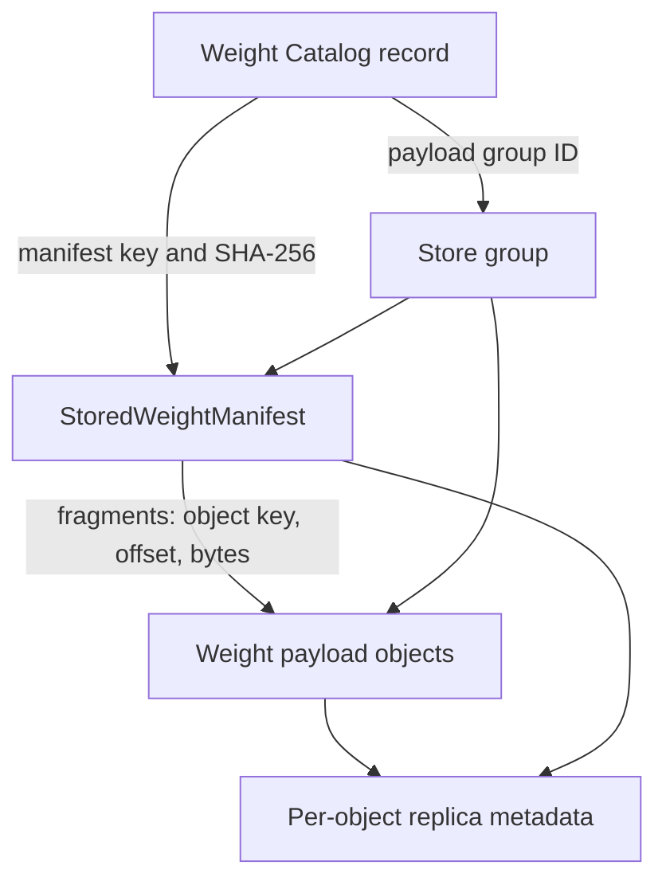

# Weight Management Architecture

Mooncake Store manages one immutable model-weight revision as a first-class
resource. A caller discovers the revision by its exact identity, acquires a
revision lease, resolves its immutable manifest, and then transfers the
manifest's payload ranges. Callers do not need to know the manifest object key
in advance.

This design adds revision-level discovery and lifecycle control without adding
independent tensor-level management metadata.

## Authority Model

Three records have distinct authority:

| Authority | Location | Owns | Does not own |
| --- | --- | --- | --- |
| Weight Catalog | Store Master memory, HA OpLog, and Master snapshot | exact revision discovery, availability, residency summary, operation progress, revision leases, manifest reference | tensor geometry, payload contents, physical replica addresses |
| `StoredWeightManifest` | immutable Store `METADATA` object | tensor descriptors and tensor-fragment-to-object-range mapping | lifecycle state, leases, live runtime addresses |
| Store object metadata | existing per-key Master metadata | replica placement and status in memory, local disk, DFS, or NoF | revision discovery, tensor meaning, serving activation |



The catalog record stays outside the payload group. It therefore remains
discoverable while the group is cold, degraded, deleting, or physically
absent. The manifest and every payload object share one `payload_group_id`.
Generic eviction and removal paths recognize that group as managed and cannot
independently reclaim one member.

The group is a logical lifecycle boundary, not a distributed transaction.
Physical work may be partial while an operation is running. The catalog keeps
the operation non-terminal until reconciliation observes the required state
for every member.

## Revision Identity and Manifest Location

A revision is addressed by:

```text
(tenant_id, namespace, resource_id, revision, weight_generation)
```

Its manifest object key is canonical:

```text
weights/<namespace>/<resource_id>/<revision>/<weight_generation>/manifest
```

The three textual path components are UTF-8 URL-encoded as individual path
segments. The manifest is hard-pinned during import and stored as
`ObjectDataType::METADATA`. Payload fragments are stored as
`ObjectDataType::WEIGHT` in the same group.

After publication, the manifest key, manifest SHA-256, payload group ID,
payload-key SHA-256, payload count, and logical byte count are immutable.
The Master validates object type, exact group membership, count, logical
bytes, and the digest of sorted payload keys. It deliberately does not parse
the tensor manifest body. The Python load path verifies the stored manifest's
identity and SHA-256 before planning tensor ranges.

## State Model

Availability, physical residency, and an in-progress operation are separate:

| Dimension | Values | Meaning |
| --- | --- | --- |
| Availability | `IMPORTING`, `READY`, `DEGRADED`, `DELETING`, `DELETED` | whether the complete revision is safe to discover and load |
| Residency | `UNKNOWN`, `HOT`, `COLD`, `MIXED`, `ABSENT` | observed placement across required group members |
| Operation | `NONE`, `EVICTING`, `REHYDRATING`, `REPAIRING` | durable non-terminal group work |

`READY` means the manifest and every required payload object have a readable
replica. DRAM eviction changes residency but does not by itself make a revision
unavailable. Missing required members produce `DEGRADED`; complete physical
removal produces the retained `DELETED`/`ABSENT` tombstone.

Every mutation is fenced by `expected_metadata_generation`. A stale writer
fails with `STALE_GENERATION`. A retry of an uncertain import commit with the
same generation and immutable manifest reference is idempotent.

## Import and Publication

The managed upload sequence is:

1. `BeginWeightImport` creates or returns the `IMPORTING` catalog record and
   Store-issued canonical payload group ID.
2. `WeightStore` writes every payload object into that group.
3. The immutable `StoredWeightManifest` is committed last into the same group.
4. `CommitWeightImport` validates exact group membership and the manifest
   reference, then durably publishes `READY`.
5. `GetWeightRevision` or bounded `ListWeightRevisions` can discover it.

`READY` is never inferred from key prefixes. An abandoned import is handled by
the explicit abort/reconciliation policy.

## Load and Revision Leases

`load_weight_revision` first resolves the exact catalog identity and acquires a
revision lease against the returned metadata generation. It then reads and
validates the manifest, plans ranges, and executes Store-to-runtime transfers.
The client renews short leases in the background until all synchronous transfer
work reaches a terminal state, and releases the lease in both success and
exception paths.

A live revision lease blocks deletion and residency operations that could
remove the last readable replica. Revision leases do not replace framework
allocation guards, runtime binding generations, or Store's per-object read
leases; those protect different ownership boundaries.

## Residency, Rehydration, and Deletion

`StartWeightResidencyOperation` durably records the operation ID, target,
fenced catalog generation, and progress. Reconciliation then uses existing
per-object primitives:

- `EVICTING` removes memory replicas only after a readable cold replica exists
  for each affected member;
- `REHYDRATING` queues promotion for every group member and waits until all
  required members have readable memory replicas;
- busy or incomplete members keep the operation in progress;
- deletion blocks new leases, waits for live leases, removes payload objects,
  removes the manifest last, verifies absence, and retains a tombstone.

Generic `BatchEvict`, quota eviction, explicit remove, and cleanup paths skip
managed groups. Only the weight lifecycle path may change their aggregate
residency or availability.

## Recovery and HA Rollout

Catalog metadata, leases, and operation records use durable-before-visible
OpLog publication. Standby replay stores them in a separate weight-catalog
namespace rather than encoding them as fake object metadata. Master snapshots
carry an optional `weight_catalog` section; an older snapshot without the
section restores an empty catalog while preserving ordinary KV metadata.
Derived group indexes are rebuilt from restored catalog records.

Clusters using HA plus the etcd batch OpLog fail closed for weight-management
mutations unless the operator sets
`weight_management_oplog_capability_confirmed=true`. Set it only after every
configured standby runs a version that understands all weight metadata and
lease OpLog entries. This is an explicit rolling-upgrade capability assertion,
not automatic standby discovery. Reads and ordinary KV operations are not
gated by it.

## Serving-System Boundary

Store owns durable revision discovery, readable-residency state, leases, and
safe reclamation. SGLang or another runtime owns live GPU addresses, runtime
bindings, allocation guards, and worker-local snapshot generations. Slime,
Kubernetes, Ray, or another serving control plane owns multi-worker activation,
traffic switching, and rollback. Store does not choose a globally active
serving revision.

## Migration from Unmanaged Manifests

`WeightStore.load_manifest(manifest_key)` remains available for compatibility,
but it is explicitly unmanaged: it provides no catalog discovery, revision
lease, aggregate lifecycle, or reclamation guarantee.

New integrations should:

1. publish with `plan_managed_upload` or `begin_managed_weight_snapshot`;
2. retain the returned `WeightRevisionIdentity` rather than a manifest key;
3. discover with `get_weight_revision` or `list_weight_revisions`;
4. load with `load_weight_revision`, which verifies the manifest and holds the
   revision lease through transfer completion.

